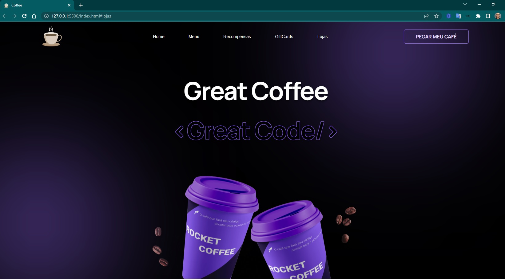
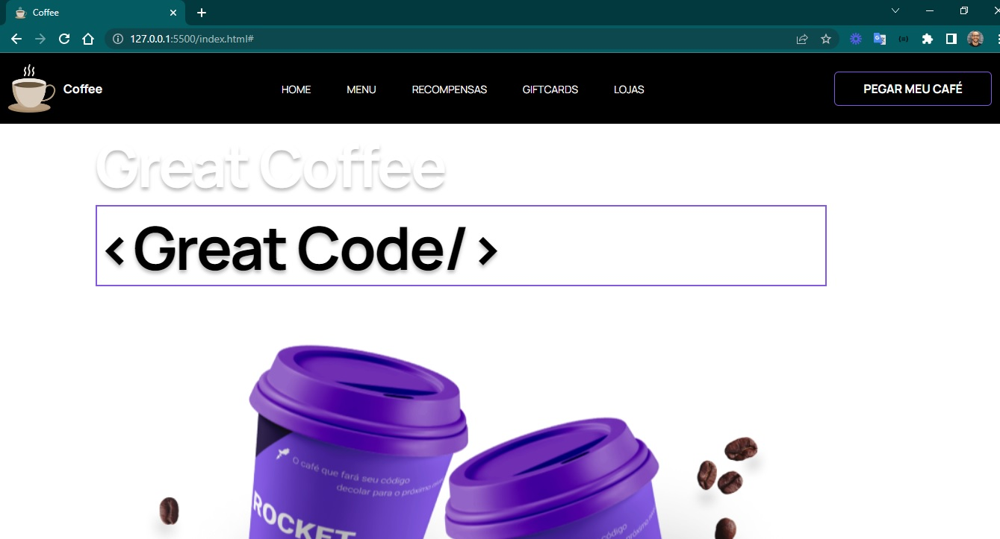
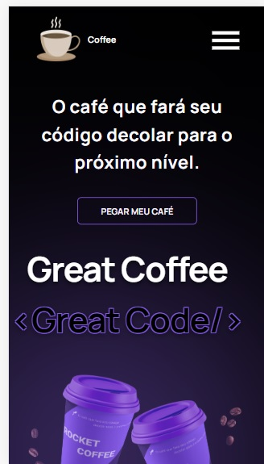
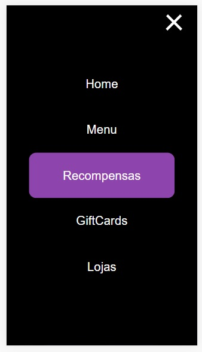
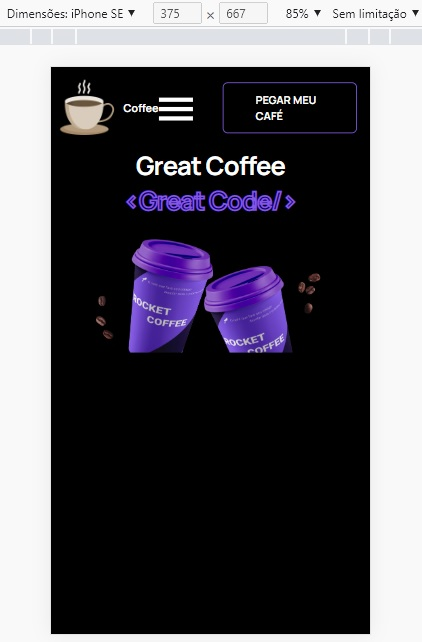

<h4 align="center"> 
	🚧 Rocket Coffee 🚀
</h4>

<p align="center" style="display: flex; align-items: flex-start; justify-content: center;">
  
</p>    

### 💻 Sobre o desafio 

Neste desafio você deverá desenvolver uma homepage para uma marca de café.

#### 💻 Techs

- Nível de dificuldade: Intermediário
- HTML
- CSS
- JavaScript

#### 💻 Como começar? 

1 - Use o link do [Figma](https://www.figma.com/file/tFoovGllUttTebdUTDVdT8/RocketCoffee/duplicate)   como base para o projeto. Também disponibilizamos para download todos os assets necessários (imagens e ícones), para fazer o download basta clicar no link acima.  

2 - Leia com atenção todas as instruções do desafio.

3 - Bora codar! Lembre-se que você pode usar as tecnologias que se sentir mais confortável, mas também pode se desafiar usando novas techs, fazendo modificações e/ou adicionando funcionalidades no projeto como preferir. 🚀

4 - Compartilhe seu resultado ou tire suas dúvidas na nossa [**comunidade aberta**](https://discord.gg/bacwY2gDCF)  

### 💡 Conteúdos Aplicados

Neste desafio você vai construir uma homepage para uma marca de café*.* Caso você ainda não tenha feito os cursos do Discover ou queira fazer uma revisão, segue abaixo uma lista dos cursos e documentações que podem te ajudar a resolver este desafio.

- [O guia estelar de HTML](https://app.rocketseat.com.br/node/o-guia-estelar-de-html)
- [O guia estelar de CSS](https://app.rocketseat.com.br/node/o-guia-estelar-de-css)
- [Posicionando foguetes](https://app.rocketseat.com.br/node/posicionando-foguetes)
- [Formulários de outro planeta](https://app.rocketseat.com.br/node/formularios-de-outro-planeta)
- [Alinhando os planetas](https://app.rocketseat.com.br/node/flexbox)
- [App bonito, até nos textos](https://app.rocketseat.com.br/node/flexbox)
- [O Guia Estelar de JavaScript](https://app.rocketseat.com.br/node/o-guia-estelar-de-java-script)
- [Pilotando com a DOM](https://app.rocketseat.com.br/node/pilotando-com-a-dom)

### ✅ [Requisitos](https://efficient-sloth-d85.notion.site/Desafio-RocketCoffee-7802895f0dd44da5a6f71a64badc7e72) 

- [x] layout responsivo 
- [ ] layout do [Figma](https://www.figma.com/file/tFoovGllUttTebdUTDVdT8/RocketCoffee/duplicate) 
- [x] Na versão mobile, ao clicar no menu hamburger deverá exibir um menu responsivo: aperfeiçoar o background
- [x] Adicionar `hover` nos botões.

### 🎨 Style Guide


#### 🎨 css

- [x] Para criar o stroke do título `<Great Code />` utilize a seguinte estilização:
    ```css
    text-shadow: -1px -1px 0 var(--button), 1px -1px 0 var(--button), -1px 1px 0 var(--button), 1px 1px 0 var(--button);
    ```
- Eu tinha utilizado o trecho a seguir, mas a primeira opção é a melhor.
    ```css
      -webkit-text-stroke: 2px var(--button);
      text-shadow: 0px 4px 4px rgba(0, 0, 0, 0.25);
      opacity: 1;
    ```
- [x] Adicionando animações: botões de menu

#### 🎨 Cores 

- [x] Adicionar variáveis
```css
:root {
  --backgrond: #000;
  --text-color: #FFF;
  --button: #8257E5;
  --border: #29292E;
  --border-menu-mobile: #A8A8B3;
  --text-color-menu-mobile: #E1E1E6;
}
```

#### 🎨 Fontes 

- [x] font-family: Manrope; font-weight: 400 e 700 

### 📅 Entregas

A ideia é dominar o processo e o fluxo de desenvolver projetos e por isso, listados e descritos as tarefas em readme.

- [x] Logo
- [x] Header
- [x] Banner
- [x] Luzes no background 
- [x] Menu com 5 Itens: estilizar hover
- [x] Background com os efeitos nos círculos
- [x] Botão: estilizar 
- [x] criar âncoras do menu

#### 📅 Próximos passos

- [ ] Botão: uma funcionalidade
- [ ] estilizar seção main
- [ ] Hamburguer: na posição correto no mobile, usar as svg 

#### 📅 Gestão do projeto

- [x] Organizando os detalhes do projeto no readme.md
- [x] Uma branch main e uma developer, uma branch para cada tarefa
- [x] Favicon

#### 📅 Aperfeiçoar em detalhes

- [ ] [Learn Responsive Design](https://web.dev/learn/design/)
- [ ] [Learn CSS](https://web.dev/learn/css/)

#### 📅 Telas Finais

- Desktop

<p align="center" style="display: flex; align-items: flex-start; justify-content: center;">

  
  
</p>  

- Mobile

<p align="center" style="display: flex; align-items: flex-start; justify-content: center;">
   
   
   
</p>  

#### 📅 Consultas

- [z-index](https://developer.mozilla.org/en-US/docs/Web/CSS/z-index)

Feito com ❤️ por Douglas A B Novato. 👋🏽 [Entre em contato!](https://www.linkedin.com/in/douglasabnovato/)
 
Fonte do projeto na [Rocketseat](https://www.rocketseat.com.br/). 👋 Participe da [comunidade aberta](https://discord.gg/bacwY2gDCF)!